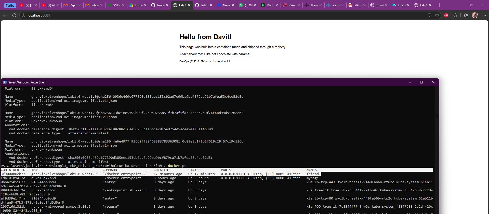

4.3 Note:
📝 Note for the README: copy the digest. It is the fingerprint of exactly what you pushed.
PS C:\Users\janis.irbe\Desktop\J_Irbe_Private_Dox\Turiba\turiba-devops-labs\lab1> docker push ghcr.io/johnthunderr/lab1-web:1.0
The push refers to repository [ghcr.io/johnthunderr/lab1-web]
8a4eaa5c2ff8: Pushed
22e5a8a110ec: Pushed
e2de96513ba9: Pushed
b335b7ac3a40: Pushed
b27cf3f7c39d: Pushed
e3320d02d578: Pushed
3d85d110b167: Pushed
27deef17bf01: Pushed
703c5424632f: Pushed
6b4dfb2e8f8a: Pushed
1.0: digest: sha256:d97d16a77a5d705ba61ad069fae18ae0b00a3b29196f722fe23aaf867c857677 size: 856

# Lab 1 · Ship it

- **Image:** `ghcr.io/johnthunderr/lab1-web:1.0`
- **Digest:** `sha256:d97d16a77a5d705ba61ad069fae18ae0b00a3b29196f722fe23aaf867c857677`
- **Platforms:** linux/amd64, linux/arm64
- **Partner's image I ran:** `ghcr.io/elvenhope/lab1.0-web:1.0` (digest matched: yes)
PS C:\Users\janis.irbe\Desktop\J_Irbe_Private_Dox\Turiba\turiba-devops-labs\lab1> docker image inspect -f '{{index .RepoDigests 0}}' ghcr.io/elvenhope/lab1.0-web:1.0
ghcr.io/elvenhope/lab1.0-web@sha256:68aff2ff44f2e7ef5a3eabcb14a83f9662c8b0a5217ad2fd9369e3aa1b730e25

## Answers

1. Where does the kernel used by your containers come from on your laptop? Paste the `docker info` / `uname -r` output that proves it.

PS C:\Users\janis.irbe\Desktop\J_Irbe_Private_Dox\Turiba\turiba-devops-labs\lab1> docker info --format '{{.OperatingSystem}} | kernel {{.KernelVersion}} | {{.Architecture}} | {{.NCPU}} CPUs | {{.MemTotal}} bytes'
Rancher Desktop WSL Distribution (containerized) | kernel 6.18.40.1-microsoft-standard-WSL2 | x86_64 | 8 CPUs | 8185569280 bytes

PS C:\Users\janis.irbe\Desktop\J_Irbe_Private_Dox\Turiba\turiba-devops-labs\lab1>  docker run --rm alpine uname -r
6.18.40.1-microsoft-standard-WSL2

2. What is the difference between `lab1-web:1.0` and `mypage`?
lab1 is an image (read only) where mypage is a container. While i do not have a full understanding of this topic yet, as far as I have learned in colaboration with AI, we came to the videogame analogy that best describes these two are starter-kit + settlement from a startegy games. COntainer is like a new settlement/village, image is like a blueprint + starting building materials for said village. We take the image and transform into a container with all the recourses inside it.

3. In Part 2 your edit to `index.html` survived `docker stop` but not `docker rm`. Why?
Docker stop just stops the image and preserves the data, for example config files. docker rm removes them, deletes completley full image, and it must be rebuilt.

4. Your page is about 1 KB, the image is tens of MB. What do you think the rest is?
While page may be small, the image does not consist of just the page. I assume (Before S2 comes) there are other things included in the image, for example some kind of configurations, packages, installations?
